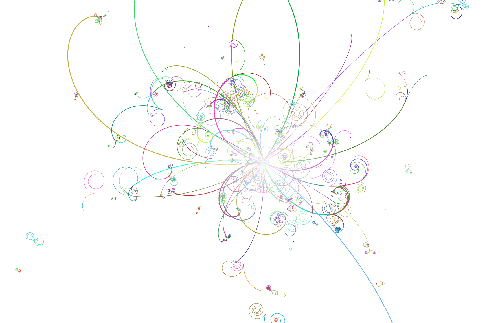
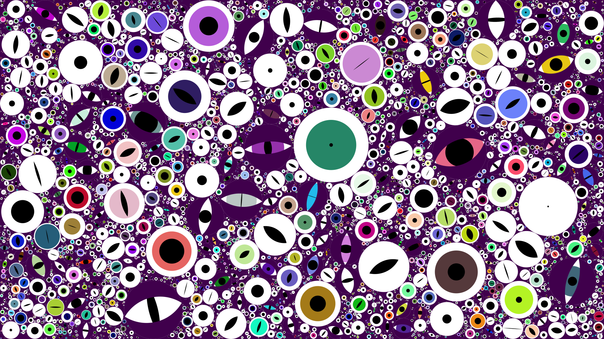
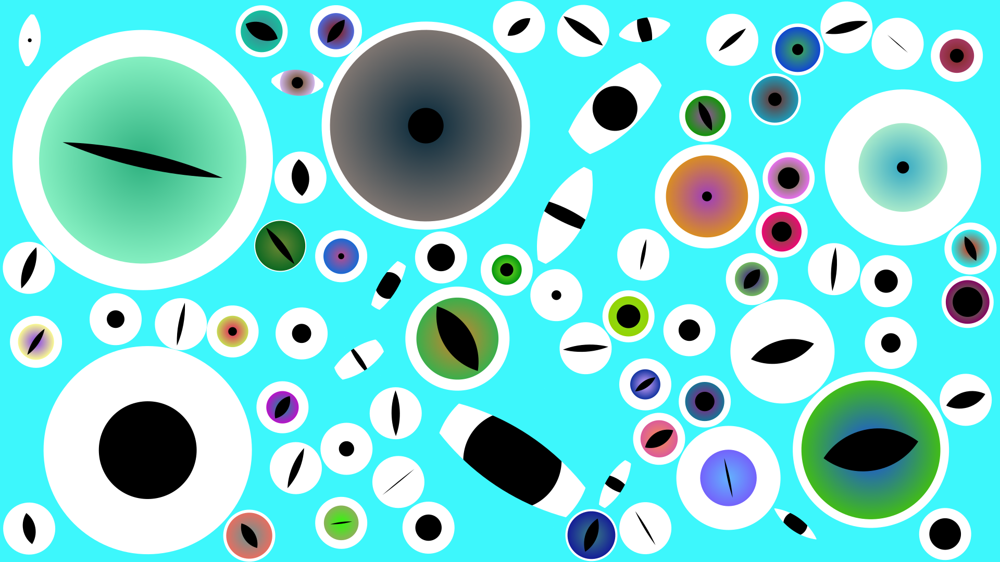
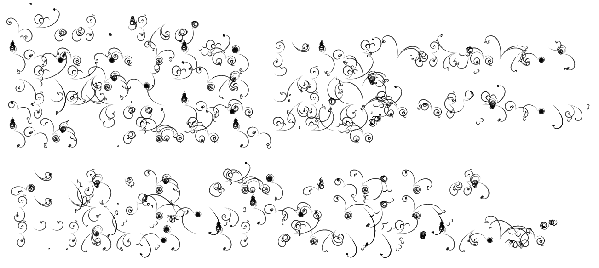
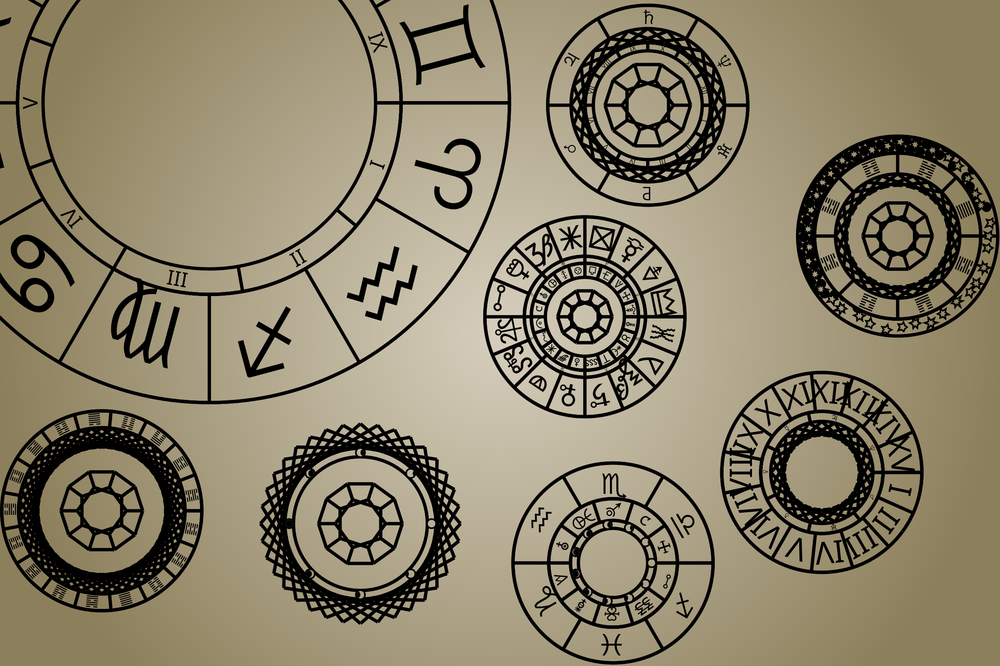
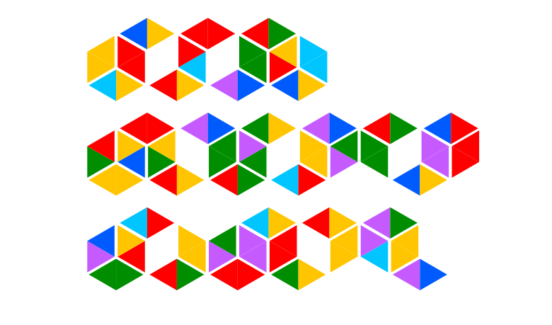
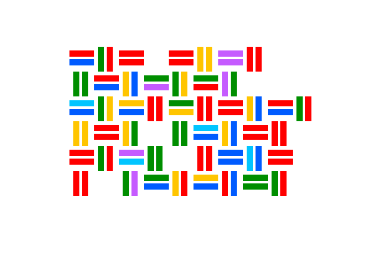

# genart

Creative coding experiments

## Python

The Python project can be setup with `poetry install`.
All experiments run from a single unified CLI:
Run `poetry run genart --help` to get a list of available commands and experiments.

## Rust

The Rust experiments are built on `nannou` and can simply be run with `cargo run`
in the experiment's directory.

## Experiments

### Bubble Chamber

* Static version available in Python
* Animated live version available in Rust
* Pre-rendered animated version available in Python+Blender [Here](https://github.com/OliverHofkens/bubble_chamber_bpy)

(Boy, I sure love simulating bubble chambers)

### Wael

### Cloudscript

### Selene

### ColorHoney

*Writing system by Kim Godgul*

